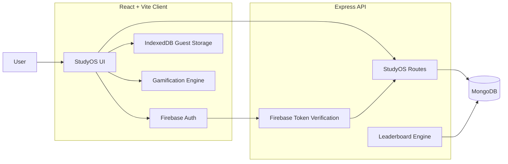

<div align="center">

# StudyOS

### Your study workflow. One place. Less friction.

Plan your work, organize subjects, take notes, stay focused, track progress,  
and compete with other students — without jumping between five different apps.

<br />

[](https://studyos-one-omega.vercel.app/)
[](https://github.com/Vaibh37/Studyos)

<br />


<br />

**Live:** [studyos-one-omega.vercel.app](https://studyos-one-omega.vercel.app/)

</div>

---

## What is StudyOS?

**StudyOS** is a full-stack productivity platform built around one simple idea:

> Studying should not require a separate app for tasks, notes, focus sessions, calendars, and progress tracking.

Instead, StudyOS connects them.

A task can belong to a subject.  
A deadline can appear in your calendar.  
A Focus session contributes to your progress.  
Your real study activity earns XP.  
And if you choose to participate, that progress can place you on the StudyOS leaderboard.

StudyOS is designed to work both as a **personal study workspace** and as a more motivating, gamified study experience.

---

# Preview

<div align="center">

## Dashboard


<br />
<br />

## Tasks


<br />
<br />

## Focus


<br />
<br />

## Progress


<br />
<br />

## Study Leaderboard


<br />
<br />

## Mobile


</div>

---

# Everything in one study workspace

<table>
<tr>

<td width="50%" valign="top">

### Dashboard

See the state of your study life without digging through pages.

- Today's overview
- Task progress
- Focus statistics
- Daily study goal
- XP and level progress
- Study streaks
- Recent activity
- Subject insights

</td>

<td width="50%" valign="top">

### Tasks

More than a basic todo list.

- Create and edit tasks
- Subject linking
- Low / Medium / High priority
- Due dates
- Due times
- Completion tracking
- Search and filtering
- Calendar deadline integration

</td>

</tr>

<tr>

<td width="50%" valign="top">

### Subjects

Subjects act as the structure connecting StudyOS.

- Custom subjects
- Subject colors
- Descriptions
- Task statistics
- Focus statistics
- Note statistics
- Search
- Sorting
- Rename-safe relationships
- Safe subject deletion

</td>

<td width="50%" valign="top">

### Notes

A focused writing space connected to your subjects.

- Create and edit notes
- Subject linking
- Pinned notes
- Search
- Filtering
- Sorting
- Persistent storage
- Account and guest support

</td>

</tr>

<tr>

<td width="50%" valign="top">

### Calendar

Deadlines and study events live together.

- Monthly calendar
- Custom study events
- Event categories
- Task deadline integration
- Event editing
- Event deletion
- Read-only task deadline entries
- Custom StudyOS date picker

</td>

<td width="50%" valign="top">

### Focus

Turn planned studying into actual activity.

- Focus timer
- Quick duration presets
- Custom duration
- Subject selection
- Pause / resume
- Session history
- Completed Focus tracking
- Subject-based statistics

</td>

</tr>

<tr>

<td width="50%" valign="top">

### Progress

See what your work actually adds up to.

- Focus time
- Task completion
- Notes activity
- Study distribution
- Subject breakdown
- Recent activity
- Streak insights
- Progress summaries

</td>

<td width="50%" valign="top">

### Leaderboard

StudyOS can also make studying competitive.

- Opt-in participation
- Public display name
- Study-based ranking
- XP-driven progression
- Privacy controls
- Aggregate study statistics only

Private tasks, notes, subject content and calendar details are not exposed on the leaderboard.

</td>

</tr>
</table>

---

# Gamification

StudyOS does not award XP just for clicking buttons.

Progress is based on **real study activity**.

### XP comes from

| Activity | Reward |
| --- | ---: |
| Focus time | **1 XP / minute** |
| Completed task | **15 XP** |
| Priority tasks | Additional priority bonus |
| Study streak | Daily streak XP |

Focus XP is capped per session to reduce abuse.

StudyOS turns real activity into:

- XP
- Levels
- Titles
- Study streaks
- Progress milestones
- Leaderboard position

The goal is not to turn studying into a game.

The goal is to make **showing up consistently feel visible**.

---

# Study Leaderboard

The StudyOS leaderboard adds a competitive layer to studying.

Instead of competing over meaningless clicks, rankings are based on actual activity generated inside StudyOS.

Users can:

- Build XP through studying
- Increase their level
- Maintain streaks
- Compare progress with others
- Climb the global StudyOS leaderboard

Participation is completely optional.

<div align="center">

### Study. Earn XP. Climb the leaderboard.

[Open StudyOS →](https://studyos-one-omega.vercel.app/)

</div>

---

# Guest mode or account mode

You can start using StudyOS without creating an account.

## Guest Mode

Guest data stays inside the browser using **IndexedDB**.

Useful for:

- Trying StudyOS immediately
- Personal local use
- Testing features without signing in

## Account Mode

Sign in using Firebase Authentication and your study data is stored through the StudyOS API in MongoDB.

Useful for:

- Persistent cloud data
- Account-based study history
- Leaderboard participation
- Long-term usage

StudyOS can also detect existing guest data after login and offer to move it into your account.

---

# Privacy-first leaderboard

The leaderboard is deliberately **opt-in**.

StudyOS does not publish:

- Email addresses
- Tasks
- Notes
- Subject content
- Calendar event details
- Private account data

Only information required for ranking and public study progress is exposed.

If you do not want to participate, you do not have to.

---

# Responsive by design

StudyOS is designed for both desktop and mobile use.

The interface includes:

- Responsive sidebar
- Mobile navigation drawer
- Mobile top bar
- Mobile Settings navigation
- Adaptive page layouts
- Responsive cards
- Touch-friendly interactions
- Custom dropdown controls
- Custom date picker

The goal is for StudyOS to feel like an actual application on smaller screens rather than a desktop dashboard squeezed into a phone.

---

# Custom UI components

StudyOS includes reusable controls built specifically for the interface instead of relying entirely on native browser UI.

## StudySelect

A reusable custom dropdown / listbox system with:

- Portal rendering
- Viewport-aware positioning
- Automatic upward / downward placement
- Keyboard dismissal
- Option descriptions
- Disabled states
- Subject colors
- Consistent StudyOS styling

## StudyDatePicker

A reusable StudyOS calendar picker with:

- Custom calendar interface
- Portal positioning
- Viewport-aware placement
- Month navigation
- Dark / light styling
- Consistent design across pages

---

# Architecture



---

# Tech Stack

## Frontend

| Technology | Purpose |
| --- | --- |
| React | User interface |
| Vite | Development and production build |
| Lucide React | Interface icons |
| Firebase Web SDK | Authentication |
| IndexedDB | Guest/local data persistence |
| CSS | StudyOS design system and responsive interface |

## Backend

| Technology | Purpose |
| --- | --- |
| Node.js | Server runtime |
| Express | REST API |
| MongoDB | Cloud data storage |
| Mongoose | Database models |
| Firebase Admin | Authentication verification |
| CORS | Frontend/API access control |
| dotenv | Environment configuration |

---

# API

StudyOS exposes API routes for core study data and platform functionality.

```text
/api/tasks
/api/subjects
/api/notes
/api/events
/api/study-sessions
/api/leaderboard
/api/health
```

Authenticated resources are scoped to the current authenticated Firebase user.

---

# Project Structure

```text
Studyos/
│
├── client/
│   ├── src/
│   │
│   ├── components/
│   │   ├── AddTask.jsx
│   │   ├── LeaderboardSettings.jsx
│   │   ├── Sidebar.jsx
│   │   ├── StudyDatePicker.jsx
│   │   ├── StudySelect.jsx
│   │   └── TaskItem.jsx
│   │
│   ├── context/
│   │   └── AuthContext.jsx
│   │
│   ├── pages/
│   │   ├── Calendar.jsx
│   │   ├── Dashboard.jsx
│   │   ├── Focus.jsx
│   │   ├── Leaderboard.jsx
│   │   ├── Notes.jsx
│   │   ├── Progress.jsx
│   │   ├── Settings.jsx
│   │   ├── Subjects.jsx
│   │   └── Tasks.jsx
│   │
│   ├── services/
│   │   ├── api.js
│   │   ├── calendarData.js
│   │   ├── gamification.js
│   │   ├── guestMigration.js
│   │   └── localDb.js
│   │
│   ├── App.jsx
│   └── App.css
│
├── server/
│   ├── config/
│   ├── middleware/
│   ├── models/
│   ├── routes/
│   ├── utils/
│   ├── server.js
│   └── package.json
│
├── docs/
│   └── screenshots/
│       ├── dashboard.png
│       ├── tasks.png
│       ├── focus.png
│       ├── progress.png
│       ├── leaderboard.png
│       └── mobile-dashboard.jpg
│
└── README.md
```

---

# Run StudyOS locally

## 1. Clone the repository

```bash
git clone https://github.com/Vaibh37/Studyos.git
cd Studyos
```

---

## 2. Install frontend dependencies

```bash
cd client
npm install
```

---

## 3. Install backend dependencies

```bash
cd ../server
npm install
```

---

# Environment Variables

## Frontend

Create:

```text
client/.env
```

Example:

```env
VITE_API_URL=http://localhost:5000

VITE_FIREBASE_API_KEY=your_value
VITE_FIREBASE_AUTH_DOMAIN=your_value
VITE_FIREBASE_PROJECT_ID=your_value
VITE_FIREBASE_STORAGE_BUCKET=your_value
VITE_FIREBASE_MESSAGING_SENDER_ID=your_value
VITE_FIREBASE_APP_ID=your_value
```

---

## Backend

Create:

```text
server/.env
```

Example:

```env
PORT=5000
MONGODB_URI=your_mongodb_connection_string
FRONTEND_URL=http://localhost:5173
```

Firebase Admin credentials are also required by the backend.

> Never commit `.env` files, database credentials, API secrets, or Firebase service-account credentials to Git.

---

# Start the backend

```bash
cd server
npm run dev
```

The backend will run on the configured port.

For example:

```text
http://localhost:5000
```

Health endpoint:

```text
http://localhost:5000/api/health
```

---

# Start the frontend

Open another terminal:

```bash
cd client
npm run dev
```

Vite will provide the local development URL.

Typically:

```text
http://localhost:5173
```

---

# Production

The frontend reads its API address from:

```env
VITE_API_URL
```

For local development this can point to:

```text
http://localhost:5000
```

For production it should point to the deployed StudyOS API.

The backend should also have the production frontend origin configured appropriately.

---

# Backup & Restore

StudyOS includes portable JSON backups from Settings.

A backup can contain:

- Tasks
- Subjects
- Notes
- Calendar events
- Focus sessions
- StudyOS preferences

Backup and migration systems are continuing to receive additional edge-case testing and hardening as StudyOS evolves.

---

# Data relationships

StudyOS keeps different areas of the application connected.

For example:

```text
Subject
   │
   ├── Tasks
   │
   ├── Notes
   │
   └── Focus Sessions
```

Renaming a subject updates linked records.

Deleting a subject does not destroy unrelated study history.

Instead, linked items are safely detached where appropriate.

This allows StudyOS to keep historical data while avoiding broken subject references.

---

# Roadmap

StudyOS is actively evolving.

## Current

- [x] Dashboard
- [x] Tasks
- [x] Subjects
- [x] Notes
- [x] Calendar
- [x] Focus timer
- [x] Progress analytics
- [x] Firebase authentication
- [x] Guest mode
- [x] MongoDB persistence
- [x] Guest → account migration
- [x] Backup & restore
- [x] XP system
- [x] Levels
- [x] Study streaks
- [x] Study leaderboard
- [x] Responsive mobile interface
- [x] Custom StudyOS controls
- [x] Subject relationship integrity

## Next

- [ ] More backup/restore edge-case testing
- [ ] More guest migration testing
- [ ] Production hardening
- [ ] Performance optimization
- [ ] Bundle code splitting
- [ ] CSS cleanup and modularization
- [ ] PWA / installable StudyOS
- [ ] Mobile app exploration

---

# Product Philosophy

StudyOS is being built around a few simple rules.

### Useful before flashy

Features should solve an actual study problem.

### Gamification should reflect real work

XP should represent actual studying — not button spam.

### Private data stays private

Competition should never require exposing personal notes or tasks.

### Everything should connect

Tasks, subjects, Focus sessions, calendar events and progress should work together instead of behaving like unrelated tools.

### Keep improving

StudyOS is not being treated as a finished one-time project.

It is being continuously tested, used, changed and improved based on real feedback.

---

# Acknowledgements

A big shoutout to **[Keshav](https://github.com/Keshavcodes3)** for exploring an earlier version of StudyOS and giving direct product feedback around:

- UI polish
- Removing unnecessary visual clutter
- Better responsiveness
- Gamification
- A study leaderboard

That feedback directly influenced one of StudyOS's biggest updates.

The suggestions were taken seriously, implemented, tested, and shipped into the live version.

**Good feedback deserves credit. 🤝**

---

# Feedback

StudyOS is still evolving.

If you try it and notice something that could be better, feedback is genuinely welcome.

You can:

- Open the live app
- Explore the features
- Join the leaderboard
- Compete with other StudyOS users
- Report bugs
- Suggest improvements
- Open an issue on GitHub

<div align="center">

### Try StudyOS

[](https://studyos-one-omega.vercel.app/)

</div>

---

# Author

<div align="center">

## Vaibh37

Independent developer focused on full-stack development, building real projects, and learning by shipping.

<br />

[](https://github.com/Vaibh37)

<br />
<br />

### If StudyOS helps you, consider starring the repository.

It helps more people discover the project.

<br />

**Plan. Focus. Track. Improve. Compete.**

<br />

[Launch StudyOS →](https://studyos-one-omega.vercel.app/)

</div>