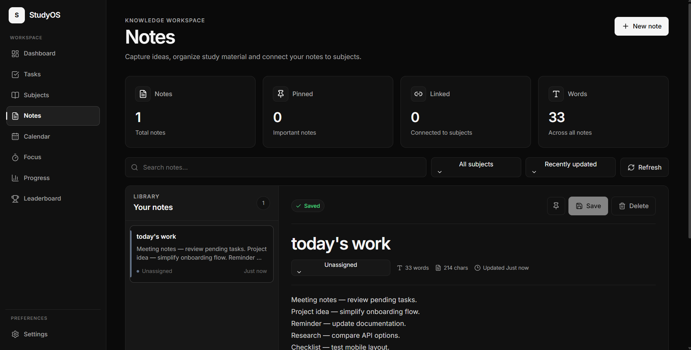
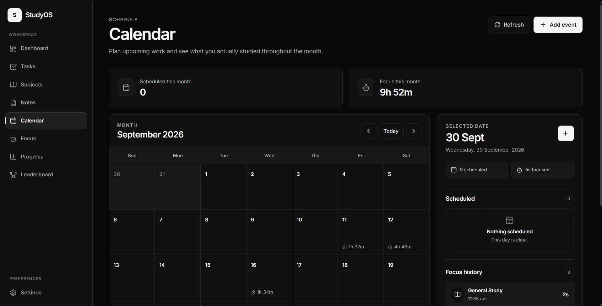
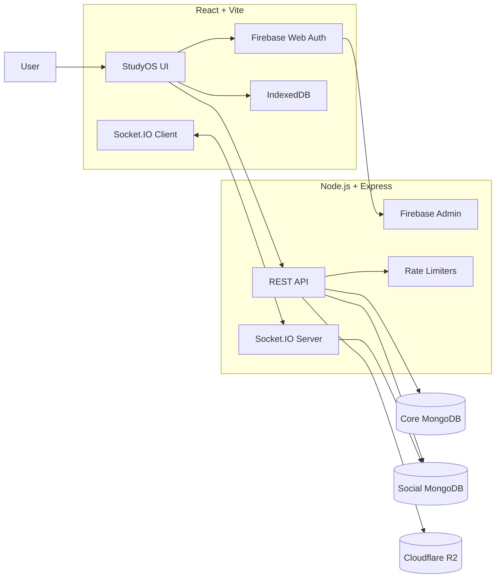

<div align="center">

# StudyOS

### Plan. Focus. Study together.

A full-stack study platform for tasks, subjects, notes, focus sessions, progress tracking, leaderboards, and real-time study groups.

<br />

[](https://studyos37.vercel.app/)
[](https://github.com/Vaibh37/Studyos)

<br />


</div>

---

## StudyOS V3

StudyOS started as a personal study dashboard.

V3 turns it into a connected study platform.

The original productivity system is still there: tasks, subjects, notes, calendar, focus sessions, progress, XP, streaks, and the global leaderboard.

V3 adds the social layer:

- Study Groups
- Public and private groups
- Invite-code joining
- Real-time group chat
- Message replies with jump-to-source
- Message reactions
- Typing indicators
- Attachment uploads
- Message unsend and delete-for-me
- Live study presence
- Group activity and leaderboard data
- Full mobile group and chat interfaces
- API and chat rate limiting

**Production:** [studyos37.vercel.app](https://studyos37.vercel.app/)

---

## Why StudyOS?

Studying usually gets split across several tools.

One app for tasks.  
Another for notes.  
Another timer.  
Another calendar.  
Another place to track progress.

StudyOS keeps those systems connected.

A task can belong to a subject.  
A Focus session contributes to progress.  
Real study activity earns XP.  
Deadlines appear alongside study events.  
Groups let students study and communicate together without leaving the platform.

The goal is simple:

> Make studying easier to organize, easier to measure, and easier to keep doing.

---

# V3 Social System

## Study Groups

Authenticated users can create and join study groups.

Groups support:

- Public or private visibility
- Invite codes
- Group descriptions
- Member lists
- Ownership
- Live member activity
- Group study statistics
- Group leaderboard data

## Real-time Chat

Group chat runs through Socket.IO.

Current chat features include:

- Real-time messages
- Replies
- Reply previews
- Jump to replied message
- Reactions
- Typing indicators
- Message grouping
- Day separators
- Unsend
- Delete for me
- Read-state handling
- Desktop and mobile layouts

## Attachments

Chat attachments are stored in Cloudflare R2 through its S3-compatible API.

The backend handles:

- Signed upload URLs
- Upload authorization
- Object verification
- Attachment finalization
- Signed download URLs
- Attachment metadata
- Unsent attachment protection

The application does not proxy entire file uploads through the Express server.

## Abuse Protection

V3 adds rate limiting at multiple layers.

- Global API request limiting
- Per-user attachment upload limits
- Per-user attachment finalize limits
- Socket message-send limiting
- Firebase-authenticated user keys where appropriate

The current Socket.IO message protection allows short bursts while stopping obvious spam.

---

# Core Study Workspace

## Dashboard

Your daily StudyOS overview.

- Focus statistics
- Daily study goal
- XP and level progress
- Study streaks
- Recent activity
- Subject insights
- Upcoming work


## Tasks

- Create and edit tasks
- Subject linking
- Priority levels
- Due dates and times
- Completion tracking
- Search and filtering
- Calendar integration


## Subjects

- Custom subjects
- Subject colors
- Descriptions
- Task statistics
- Focus statistics
- Note statistics
- Search and sorting
- Rename-safe relationships


## Notes

- Create and edit notes
- Subject linking
- Pinned notes
- Search and filtering
- Sorting
- Autosave
- Guest and account persistence



## Calendar

- Monthly calendar
- Custom study events
- Task deadlines
- Focus history
- Event editing
- Custom date picker



## Focus

- Focus timer
- Preset and custom durations
- Subject selection
- Pause and resume
- Timer persistence
- Session history
- Study statistics


## Progress

- Focus time
- Task completion
- Subject distribution
- Weekly activity
- 30-day consistency
- Study streaks
- Progress insights


## Leaderboard

- Opt-in participation
- Weekly rankings
- XP-based progression
- Public display names
- Aggregate study statistics
- Privacy controls


---

# Gamification

StudyOS rewards actual study activity rather than meaningless clicks.

| Activity | Reward |
| --- | ---: |
| Focus time | 1 XP / minute |
| Completed task | 15 XP |
| Priority tasks | Additional bonus |
| Study streak | Streak XP |

Progress feeds into:

- XP
- Levels
- Titles
- Study streaks
- Milestones
- Leaderboard position

---

# Guest and Account Modes

## Guest Mode

Guest data is stored locally with IndexedDB.

This is useful for trying StudyOS without signing in.

## Account Mode

Firebase Authentication is used for account identity.

Authenticated study data is stored through the StudyOS API in MongoDB.

Account mode enables persistent cloud data and social features such as groups and chat.

---

# Architecture



StudyOS uses separate persistence for the original productivity data and the newer social/group system.

---

# Tech Stack

## Frontend

| Technology | Purpose |
| --- | --- |
| React 19 | UI |
| Vite 8 | Development and production builds |
| React Router | Navigation |
| Socket.IO Client | Real-time group communication |
| Firebase Web SDK | Authentication |
| IndexedDB | Guest/local persistence |
| Lucide React | Icons |
| CSS | Responsive StudyOS design system |

## Backend

| Technology | Purpose |
| --- | --- |
| Node.js | Runtime |
| Express 5 | REST API |
| Socket.IO | Real-time communication |
| MongoDB Atlas | Core and social persistence |
| Mongoose | Database models |
| Firebase Admin | Token verification |
| Cloudflare R2 | Chat attachment storage |
| AWS SDK S3 client | R2 integration |
| express-rate-limit | HTTP abuse protection |

## Production

| Service | Purpose |
| --- | --- |
| Vercel | Frontend |
| Render | Backend |
| MongoDB Atlas | Databases |
| Firebase | Authentication |
| Cloudflare R2 | Attachment storage |

---

# API Surface

Core routes:

```text
/api/auth
/api/tasks
/api/subjects
/api/notes
/api/events
/api/study-sessions
/api/leaderboard
/api/groups
/api/health
/api/status
/api/uptime
```

Authenticated resources are scoped using Firebase identity.

Group chat itself uses authenticated Socket.IO connections.

---

# Project Structure

```text
Studyos/
├── client/
│   ├── src/
│   │   ├── components/
│   │   │   └── chat/
│   │   ├── context/
│   │   ├── hooks/
│   │   ├── pages/
│   │   │   ├── Chats.jsx
│   │   │   ├── Groups.jsx
│   │   │   ├── Dashboard.jsx
│   │   │   ├── Focus.jsx
│   │   │   ├── Tasks.jsx
│   │   │   └── ...
│   │   ├── services/
│   │   ├── styles/
│   │   ├── socket.js
│   │   └── App.jsx
│   └── package.json
│
├── server/
│   ├── config/
│   ├── middleware/
│   │   └── rateLimiters.js
│   ├── models/
│   │   └── social/
│   ├── routes/
│   │   ├── groupRoutes.js
│   │   └── groupAttachmentRoutes.js
│   ├── services/
│   │   └── r2Storage.js
│   ├── socket/
│   │   ├── liveStudySocket.js
│   │   ├── groupTypingSocket.js
│   │   ├── groupReactionSocket.js
│   │   └── socketAuth.js
│   ├── utils/
│   │   ├── groupMessageReply.js
│   │   └── socketRateLimiter.js
│   └── server.js
│
├── docs/
│   └── screenshots/
│
└── README.md
```

---

# Run Locally

Requires **Node.js 20.19+**.

## 1. Clone

```bash
git clone https://github.com/Vaibh37/Studyos.git
cd Studyos
```

## 2. Install frontend dependencies

```bash
cd client
npm install
```

## 3. Install backend dependencies

```bash
cd ../server
npm install
```

## 4. Configure environment variables

### Frontend

Create:

```text
client/.env
```

Example:

```env
VITE_API_URL=http://localhost:5000

VITE_FIREBASE_API_KEY=your_value
VITE_FIREBASE_AUTH_DOMAIN=your_value
VITE_FIREBASE_PROJECT_ID=your_value
VITE_FIREBASE_STORAGE_BUCKET=your_value
VITE_FIREBASE_MESSAGING_SENDER_ID=your_value
VITE_FIREBASE_APP_ID=your_value
```

### Backend

Create:

```text
server/.env
```

Example:

```env
PORT=5000

MONGO_URI=your_core_mongodb_connection_string
MONGO_SOCIAL_URI=your_social_mongodb_connection_string

FRONTEND_URL=http://localhost:5173

FIREBASE_PROJECT_ID=your_value
FIREBASE_CLIENT_EMAIL=your_value
FIREBASE_PRIVATE_KEY="your_value"

R2_REGION=auto
R2_ENDPOINT=your_r2_endpoint
R2_ACCESS_KEY_ID=your_value
R2_SECRET_ACCESS_KEY=your_value
R2_BUCKET_NAME=your_bucket_name
```

Never commit real database credentials, Firebase private keys, R2 secrets, or `.env` files.

## 5. Start backend

```bash
cd server
npm run dev
```

Default local API:

```text
http://localhost:5000
```

## 6. Start frontend

In another terminal:

```bash
cd client
npm run dev
```

Default Vite URL:

```text
http://localhost:5173
```

---

# Production

Frontend:

**https://studyos37.vercel.app**

Backend:

**https://studyos-iego.onrender.com**

The frontend reads the backend URL from `VITE_API_URL`.

The backend restricts browser origins through its CORS configuration.

---

# Privacy

The global leaderboard is opt-in.

StudyOS does not expose private tasks, notes, subject content, calendar details, or email addresses through the leaderboard.

Social features require authenticated accounts.

Private groups are not intended to behave like public discovery spaces.

---

# V3 Status

## Shipped

- [x] Core productivity workspace
- [x] Firebase authentication
- [x] Guest mode
- [x] MongoDB persistence
- [x] XP, levels, and streaks
- [x] Global study leaderboard
- [x] Responsive desktop and mobile UI
- [x] Dark and light themes
- [x] Study Groups
- [x] Public/private group visibility
- [x] Invite-code joining
- [x] Live group study state
- [x] Real-time group chat
- [x] Replies and jump-to-source
- [x] Reactions
- [x] Typing indicators
- [x] Chat attachments with Cloudflare R2
- [x] Message unsend/delete-for-me
- [x] API rate limiting
- [x] Socket message rate limiting
- [x] Production frontend deployment
- [x] Production backend deployment

## Next

- [ ] Automated tests for core client and server flows
- [ ] More server-side validation around leaderboard-eligible activity
- [ ] Stronger migration and restore idempotency
- [ ] Shared rate-limit storage if the backend scales to multiple instances
- [ ] Performance work for larger accounts and groups
- [ ] Updated V3 screenshots
- [ ] PWA/installable StudyOS

---

# Product Principles

**Useful before flashy.**  
Features should solve a real study problem.

**Progress should represent real work.**  
XP should come from studying, not button spam.

**Private data stays private.**  
Competition should not require exposing personal study content.

**Everything should connect.**  
Tasks, subjects, Focus, progress, groups, and chat should feel like one product.

---

# Author

<div align="center">

## Vaibh37

Building software, learning in public, and shipping what I use.

[GitHub](https://github.com/Vaibh37)

<br />

### If StudyOS is useful to you, consider starring the repository.

**Plan. Focus. Study together.**

[Launch StudyOS →](https://studyos37.vercel.app/)

</div>
