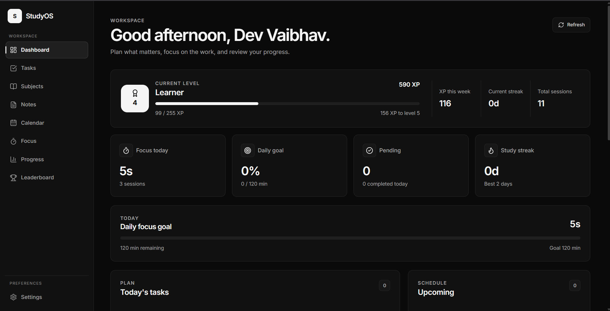
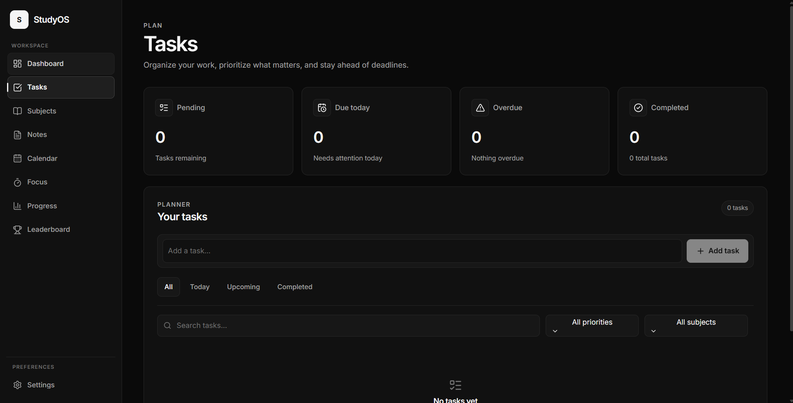
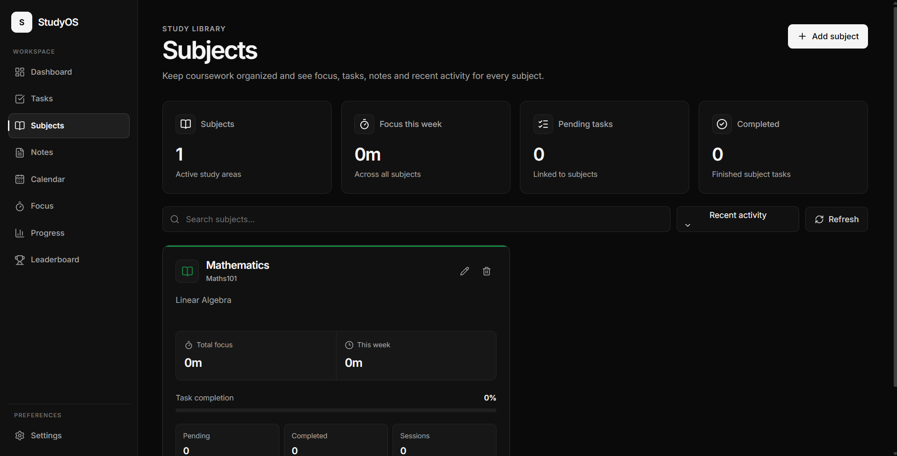
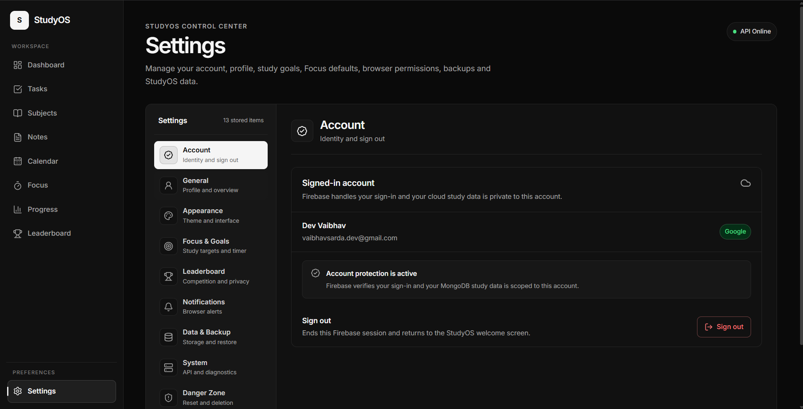
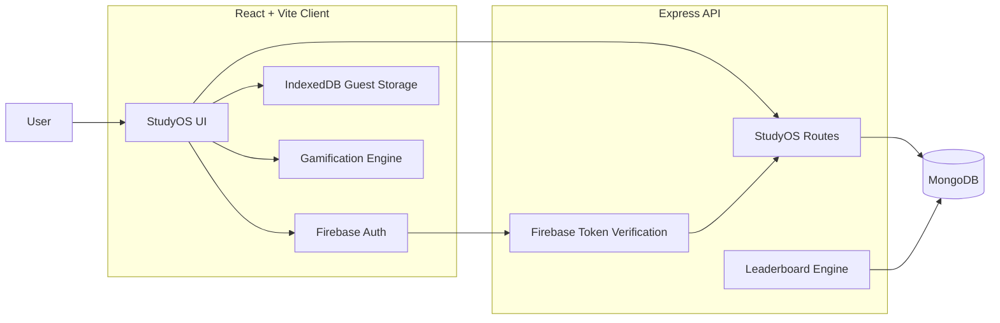

<div align="center">

# StudyOS

### Your study workflow. One place. Less friction.

Plan your work, organize subjects, take notes, stay focused, track progress,  
and compete with other students — without jumping between five different apps.

<br />

[](https://studyos37.vercel.app/)
[](https://github.com/Vaibh37/Studyos)

<br />


<br />

**Live:** [studyos37.vercel.app](https://studyos37.vercel.app/)

</div>

---

## What is StudyOS?

**StudyOS** is a full-stack productivity platform built around one simple idea:

> Studying should not require a separate app for tasks, notes, focus sessions, calendars, and progress tracking.

Instead, StudyOS connects them.

A task can belong to a subject.  
A deadline can appear in your calendar.  
A Focus session contributes to your progress.  
Your real study activity earns XP.  
And if you choose to participate, that progress can place you on the StudyOS leaderboard.

StudyOS works as both a **personal study workspace** and a lightweight competitive study system.

---

# Product Preview

Real screenshots from the current **StudyOS V2** interface.

## Dashboard



Your command center for daily goals, Focus activity, XP, streaks, tasks and upcoming work.

---

## Tasks



Plan work, prioritize what matters, connect tasks to subjects and keep deadlines visible.

---

## Subjects



Organize coursework and see Focus, task, note and activity data for each study area.

---

## Notes


Write, search and organize notes while keeping them connected to the rest of your study workspace.

---

## Calendar


See deadlines, custom study events and actual Focus history together in one monthly view.

---

## Focus


Run distraction-free subject-linked Focus sessions with presets, custom durations, pause/resume and history.

---

## Progress


Review Focus time, consistency, study streaks, subject distribution and weekly activity.

---

## Leaderboard


Opt into a weekly ranking driven by eligible Focus activity and completed tasks.

---

## Settings



Manage your account, study goals, Focus defaults, leaderboard privacy, notifications, backups and StudyOS preferences.

---

> StudyOS supports both light and dark themes with responsive layouts across desktop and mobile.

---

# Everything in one study workspace

## Dashboard

See the state of your study life without digging through pages.

- Today's overview
- Focus statistics
- Daily study goal
- XP and level progress
- Study streaks
- Recent activity
- Subject insights
- Upcoming work

## Tasks

More than a basic todo list.

- Create and edit tasks
- Subject linking
- Low / Medium / High priority
- Due dates
- Due times
- Completion tracking
- Search and filtering
- Calendar deadline integration

## Subjects

Subjects act as the structure connecting StudyOS.

- Custom subjects
- Subject colors
- Descriptions
- Task statistics
- Focus statistics
- Note statistics
- Search and sorting
- Rename-safe relationships
- Safe subject deletion

## Notes

A focused writing space connected to your subjects.

- Create and edit notes
- Subject linking
- Pinned notes
- Search
- Filtering
- Sorting
- Autosave
- Persistent storage
- Account and guest support

## Calendar

Deadlines and study events live together.

- Monthly calendar
- Custom study events
- Event categories
- Task deadline integration
- Event editing
- Event deletion
- Read-only task deadline entries
- Focus history
- Custom StudyOS date picker

## Focus

Turn planned studying into actual activity.

- Focus timer
- 25 / 50 / 90 minute presets
- Custom duration
- Subject selection
- Pause / resume
- Timer persistence
- Session history
- Completed Focus tracking
- Subject-based statistics

## Progress

See what your work actually adds up to.

- Focus time
- Task completion
- Study distribution
- Subject breakdown
- 7-day trends
- 30-day consistency
- Study streaks
- Recent activity
- Progress insights

## Leaderboard

StudyOS can also make studying competitive.

- Opt-in participation
- Public display name
- Weekly ranking
- Study-based scoring
- XP-driven progression
- Privacy controls
- Aggregate study statistics only

Private tasks, notes, subject content and calendar details are not exposed on the leaderboard.

## Settings

Control StudyOS from one place.

- Account management
- Profile settings
- Light / dark theme
- Daily study goal
- Default Focus duration
- Leaderboard privacy
- Browser notifications
- Backup and restore
- API diagnostics
- Data reset
- Account deletion

---

# Gamification

StudyOS does not award XP just for clicking buttons.

Progress is based on **real study activity**.

### XP comes from

| Activity | Reward |
| --- | ---: |
| Focus time | **1 XP / minute** |
| Completed task | **15 XP** |
| Priority tasks | Additional priority bonus |
| Study streak | Daily streak XP |

Focus XP is capped per session to reduce abuse.

StudyOS turns real activity into:

- XP
- Levels
- Titles
- Study streaks
- Progress milestones
- Leaderboard position

The goal is not to turn studying into a game.

The goal is to make **showing up consistently feel visible**.

---

# Study Leaderboard

The StudyOS leaderboard adds a competitive layer to studying.

Instead of competing over meaningless clicks, rankings are based on activity generated inside StudyOS.

Users can:

- Build XP through studying
- Increase their level
- Maintain streaks
- Compare progress with others
- Climb the StudyOS leaderboard

Participation is completely optional.

<div align="center">

### Study. Earn XP. Climb the leaderboard.

[Open StudyOS →](https://studyos37.vercel.app/)

</div>

---

# Guest mode or account mode

You can start using StudyOS without creating an account.

## Guest Mode

Guest data stays inside the browser using **IndexedDB**.

Useful for:

- Trying StudyOS immediately
- Personal local use
- Testing features without signing in

## Account Mode

Sign in using Firebase Authentication and your study data is stored through the StudyOS API in MongoDB.

Useful for:

- Persistent cloud data
- Account-based study history
- Leaderboard participation
- Long-term usage

StudyOS can detect existing guest data after login and offer to move it into your account.

---

# Privacy-first leaderboard

The leaderboard is deliberately **opt-in**.

StudyOS does not publish:

- Email addresses
- Tasks
- Notes
- Subject content
- Calendar event details
- Private account data

Only information required for ranking and public study progress is exposed.

If you do not want to participate, you do not have to.

---

# Responsive by design

StudyOS is designed for both desktop and mobile use.

The interface includes:

- Responsive sidebar
- Mobile navigation drawer
- Mobile top bar
- Mobile Settings navigation
- Adaptive page layouts
- Responsive cards
- Touch-friendly interactions
- Custom dropdown controls
- Custom date picker

The goal is for StudyOS to feel like an actual application on smaller screens rather than a desktop dashboard squeezed into a phone.

---

# StudyOS V2 Design System

The V2 interface replaces the original highly decorative UI with a more restrained product design.

The system uses:

- Inter typography
- Neutral black, white and gray surfaces
- Functional color only where it communicates meaning
- Consistent spacing
- Shared design tokens
- Reusable controls
- Light and dark themes
- Page-specific modular stylesheets
- Responsive layouts
- Minimal shadows
- Reduced visual noise

---

# Custom UI components

## StudySelect

A reusable custom dropdown / listbox system with:

- Portal rendering
- Viewport-aware positioning
- Automatic upward / downward placement
- Keyboard dismissal
- Option descriptions
- Disabled states
- Subject colors
- Consistent StudyOS styling

## StudyDatePicker

A reusable StudyOS calendar picker with:

- Custom calendar interface
- Portal positioning
- Viewport-aware placement
- Month navigation
- Dark / light styling
- Consistent design across pages

---

# Architecture



---

# Tech Stack

## Frontend

| Technology | Purpose |
| --- | --- |
| React 19 | User interface |
| Vite 8 | Development and production build |
| React Router | Navigation foundation |
| Lucide React | Interface icons |
| Firebase Web SDK | Authentication |
| IndexedDB | Guest/local data persistence |
| CSS | StudyOS V2 design system and responsive interface |

## Backend

| Technology | Purpose |
| --- | --- |
| Node.js | Server runtime |
| Express 5 | REST API |
| MongoDB | Cloud data storage |
| Mongoose | Database models |
| Firebase Admin | Authentication verification |
| CORS | Frontend/API access control |
| dotenv | Environment configuration |

## Deployment

| Service | Purpose |
| --- | --- |
| Vercel | Frontend |
| Render | Express API |
| MongoDB Atlas | Database |
| Firebase | Authentication |

---

# API

StudyOS exposes API routes for core study data and platform functionality.

```text
/api/tasks
/api/subjects
/api/notes
/api/events
/api/study-sessions
/api/leaderboard
/api/health
```

Authenticated resources are scoped to the currently authenticated Firebase user.

---

# Project Structure

```text
Studyos/
│
├── client/
│   ├── src/
│   │
│   ├── components/
│   │   ├── AddTask.jsx
│   │   ├── LeaderboardSettings.jsx
│   │   ├── Sidebar.jsx
│   │   ├── StudyDatePicker.jsx
│   │   ├── StudySelect.jsx
│   │   └── TaskItem.jsx
│   │
│   ├── context/
│   │   └── AuthContext.jsx
│   │
│   ├── pages/
│   │   ├── Calendar.jsx
│   │   ├── Dashboard.jsx
│   │   ├── Focus.jsx
│   │   ├── Leaderboard.jsx
│   │   ├── Notes.jsx
│   │   ├── Progress.jsx
│   │   ├── Settings.jsx
│   │   ├── Subjects.jsx
│   │   └── Tasks.jsx
│   │
│   ├── services/
│   │   ├── api.js
│   │   ├── calendarData.js
│   │   ├── gamification.js
│   │   ├── guestMigration.js
│   │   ├── localDb.js
│   │   └── studySessionData.js
│   │
│   ├── styles/
│   │   ├── base.css
│   │   ├── calendar-v2.css
│   │   ├── focus-v2.css
│   │   ├── global-polish.css
│   │   ├── leaderboard-v2.css
│   │   ├── notes-v2.css
│   │   ├── progress-v2.css
│   │   ├── subjects-v2.css
│   │   ├── tasks-v2.css
│   │   ├── tokens.css
│   │   ├── typography-v2.css
│   │   └── v2.css
│   │
│   ├── App.jsx
│   ├── App.css
│   └── main.jsx
│
├── server/
│   ├── config/
│   ├── middleware/
│   ├── models/
│   ├── routes/
│   ├── utils/
│   ├── server.js
│   └── package.json
│
├── docs/
│   └── screenshots/
│       ├── Dashboard.png
│       ├── Tasks.png
│       ├── Subjects.png
│       ├── notes.png
│       ├── calendar.png
│       ├── focus.png
│       ├── progress.png
│       ├── leaderboard.png
│       └── settings.png
│
└── README.md
```

---

# Run StudyOS locally

## 1. Clone the repository

```bash
git clone https://github.com/Vaibh37/Studyos.git
cd Studyos
```

## 2. Install frontend dependencies

```bash
cd client
npm install
```

## 3. Install backend dependencies

```bash
cd ../server
npm install
```

---

# Environment Variables

## Frontend

Create:

```text
client/.env
```

Example:

```env
VITE_API_URL=http://localhost:5000

VITE_FIREBASE_API_KEY=your_value
VITE_FIREBASE_AUTH_DOMAIN=your_value
VITE_FIREBASE_PROJECT_ID=your_value
VITE_FIREBASE_STORAGE_BUCKET=your_value
VITE_FIREBASE_MESSAGING_SENDER_ID=your_value
VITE_FIREBASE_APP_ID=your_value
```

## Backend

Create:

```text
server/.env
```

Example:

```env
PORT=5000
MONGODB_URI=your_mongodb_connection_string
FRONTEND_URL=http://localhost:5173
```

Firebase Admin credentials are also required by the backend.

> Never commit `.env` files, database credentials, API secrets or Firebase service-account credentials to Git.

---

# Start the backend

```bash
cd server
npm run dev
```

Example:

```text
http://localhost:5000
```

Health endpoint:

```text
http://localhost:5000/api/health
```

---

# Start the frontend

Open another terminal:

```bash
cd client
npm run dev
```

Typically:

```text
http://localhost:5173
```

---

# Production

The production frontend is available at:

```text
https://studyos37.vercel.app
```

The frontend reads its API address from:

```env
VITE_API_URL
```

The backend must allow the deployed frontend origin through its CORS configuration.

---

# Backup & Restore

StudyOS includes portable JSON backups from Settings.

A backup can contain:

- Tasks
- Subjects
- Notes
- Calendar events
- Focus sessions
- StudyOS preferences

Backup and migration systems will continue receiving additional edge-case testing and hardening as StudyOS evolves.

---

# Data relationships

StudyOS keeps different areas of the application connected.

```text
Subject
   │
   ├── Tasks
   │
   ├── Notes
   │
   └── Focus Sessions
```

Renaming a subject updates linked records.

Deleting a subject does not destroy unrelated study history.

Instead, linked items are safely detached where appropriate.

This allows StudyOS to preserve historical data while avoiding broken subject references.

---

# Roadmap

StudyOS V2 has completed its main interface redesign and the legacy page-level CSS has been split into dedicated stylesheets.

## Current

- [x] Dashboard
- [x] Tasks
- [x] Subjects
- [x] Notes
- [x] Calendar
- [x] Focus timer
- [x] Progress analytics
- [x] Firebase authentication
- [x] Google authentication
- [x] Guest mode
- [x] MongoDB persistence
- [x] Guest → account migration
- [x] Backup & restore
- [x] XP system
- [x] Levels
- [x] Study streaks
- [x] Study leaderboard
- [x] Responsive mobile interface
- [x] Dark and light themes
- [x] StudyOS V2 monochrome design system
- [x] Page-level CSS modularization
- [x] Legacy App.css cleanup
- [x] Subject relationship integrity
- [x] Production frontend deployment
- [x] Production API deployment

## Remaining engineering work

These are intentionally deferred so the current V2 can settle before another large refactor.

- [ ] Finish URL-based navigation with React Router
- [ ] Introduce a repository/data-access layer so pages stop branching directly between guest storage and API calls
- [ ] Centralize shared client data and reduce repeated page-level fetching
- [ ] Make guest → account migration fully idempotent and safe after partial failures
- [ ] Make backup/restore imports idempotent and add malformed/duplicate backup tests
- [ ] Harden leaderboard scoring and validate leaderboard-eligible activity on the server
- [ ] Validate Focus subject ownership on the backend and store canonical subject data
- [ ] Move important preferences to cloud-backed account settings
- [ ] Improve analytics queries so large accounts do not require loading full collections
- [ ] Add automated tests for core client flows and server invariants
- [ ] Add bundle/code splitting where it meaningfully improves startup performance
- [ ] Complete a dark/light/mobile visual QA pass after V2 receives real usage
- [ ] PWA / installable StudyOS
- [ ] Explore a dedicated mobile app only if the web product proves the need

---

# Product Philosophy

### Useful before flashy

Features should solve an actual study problem.

### Gamification should reflect real work

XP should represent actual studying — not button spam.

### Private data stays private

Competition should never require exposing personal notes or tasks.

### Everything should connect

Tasks, subjects, Focus sessions, calendar events and progress should work together instead of behaving like unrelated tools.

### Keep improving

StudyOS is not being treated as a finished one-time project.

It is continuously tested, used and improved based on real feedback.

---

# Acknowledgements

A shoutout to **[Keshav](https://github.com/Keshavcodes3)** for exploring an earlier version of StudyOS and giving direct product feedback around:

- UI polish
- Removing unnecessary visual clutter
- Better responsiveness
- Gamification
- A study leaderboard

That feedback influenced one of StudyOS's biggest updates.

**Good feedback deserves credit. 🤝**

---

# Feedback

StudyOS is still evolving.

If you try it and notice something that could be better:

- Open an issue
- Report a bug
- Suggest an improvement
- Try the live app
- Join the leaderboard

<div align="center">

### Try StudyOS

[](https://studyos37.vercel.app/)

</div>

---

# Author

<div align="center">

## Vaibh37

Independent developer focused on full-stack development, building real projects, and learning by shipping.

<br />

[](https://github.com/Vaibh37)

<br />
<br />

### If StudyOS helps you, consider starring the repository.

<br />

**Plan. Focus. Track. Improve. Compete.**

<br />

[Launch StudyOS →](https://studyos37.vercel.app/)

</div>