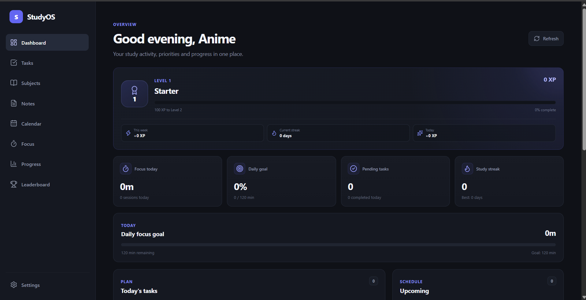
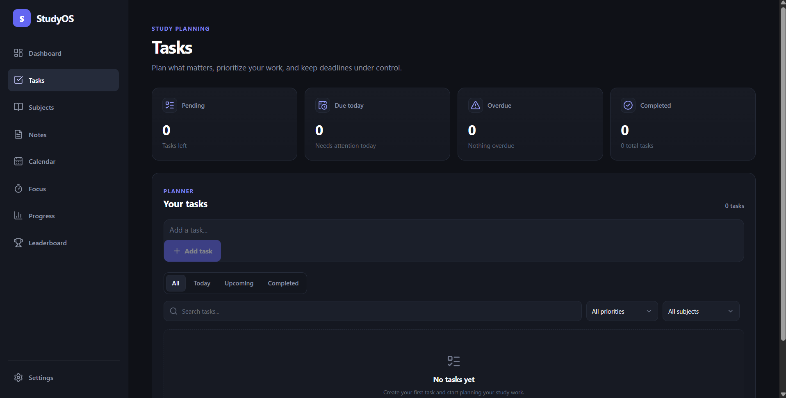
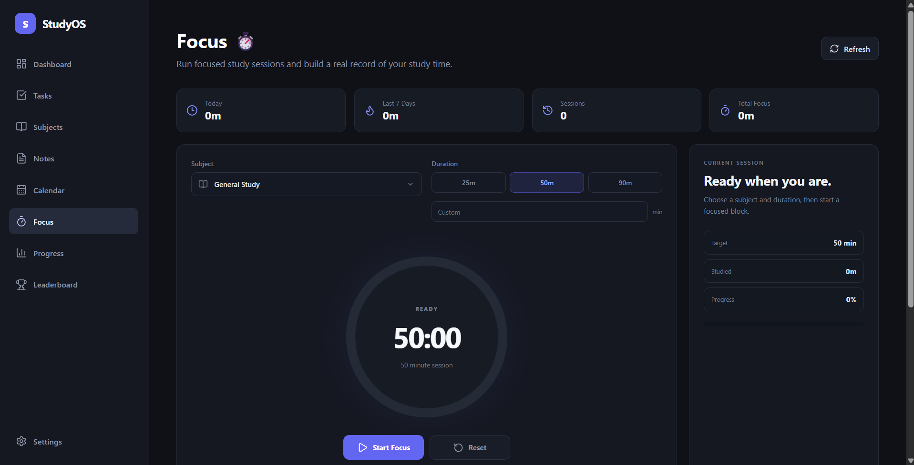
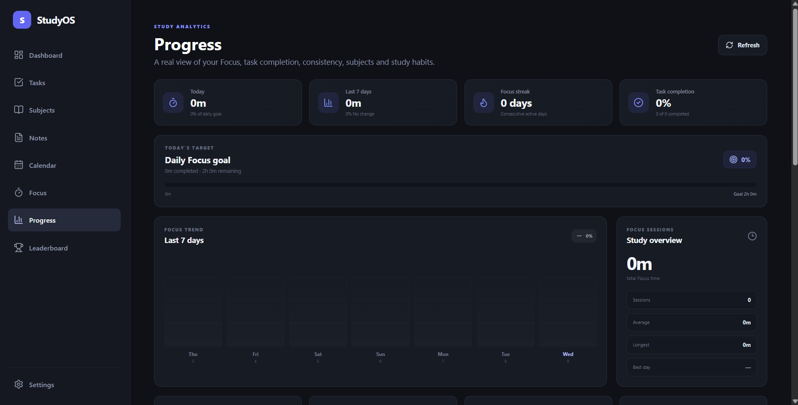
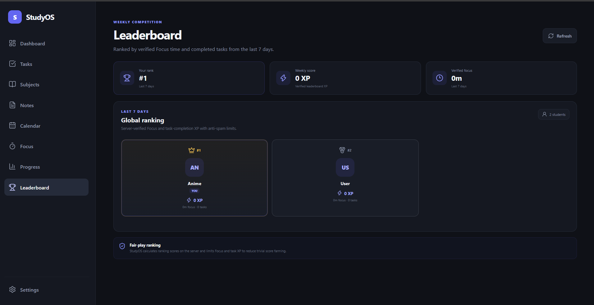
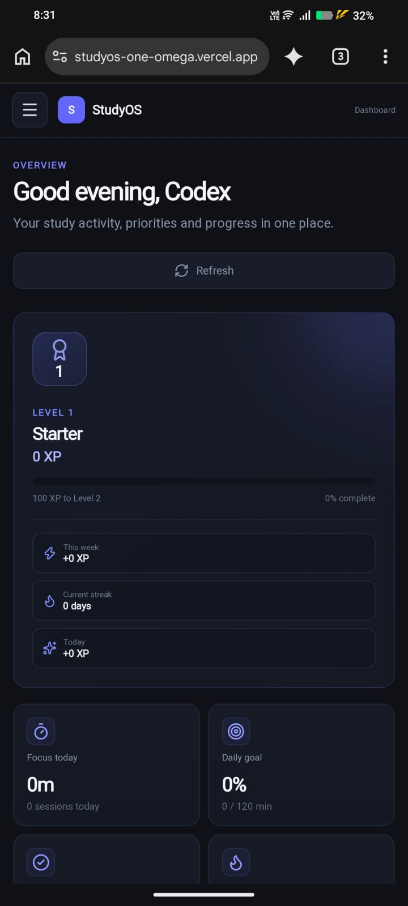
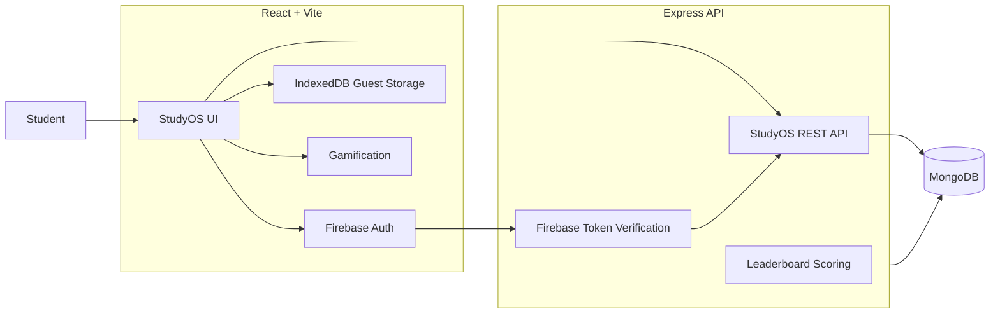

<div align="center">


# StudyOS

### Plan. Focus. Track. Compete.

A full-stack study workspace that brings **tasks, subjects, notes, calendar, focus sessions, progress analytics, gamification and a study leaderboard** into one connected system.

<br />

[](https://studyos-one-omega.vercel.app/)
[](https://github.com/Vaibh37/Studyos)

<br />


</div>

<br />



<br />

> **StudyOS is built around one idea:** studying should not require five disconnected apps.

Tasks understand subjects. Deadlines appear in the calendar. Focus sessions become progress data. Real activity earns XP. And students who opt in can compete on the leaderboard.

---

## Why StudyOS?

Most productivity apps solve one piece of the problem. StudyOS connects the pieces.

| Plan | Study | Understand your progress |
| --- | --- | --- |
| Tasks with priorities and deadlines | Focus sessions linked to subjects | Daily and weekly Focus analytics |
| Subjects as the organizing layer | Notes connected to subjects | Task completion and study streaks |
| Calendar events + task deadlines | Custom Focus durations | XP, levels and leaderboard ranking |

The goal is simple: **less switching, more studying.**

---

## Core features

### Dashboard

Your study activity, priorities and progress in one place.

- XP, level and streak overview
- Today's Focus progress
- Pending and completed task stats
- Daily Focus goal
- Upcoming deadlines and events
- 7-day activity view
- Study insights and recent sessions

### Tasks

A study planner rather than a plain todo list.

- Create, edit and complete tasks
- Low, medium and high priority
- Subject linking
- Due dates and due times
- Today / Upcoming / Completed views
- Search and filtering
- Automatic calendar deadline integration

### Subjects

The layer that connects your StudyOS data.

- Custom subject names, codes and colors
- Search and sorting
- Task, note and Focus relationships
- Subject-level activity metrics
- Rename-safe linked data
- Safe deletion without destroying linked tasks or notes

### Notes

A lightweight knowledge base that stays connected to your study system.

- Create and edit notes
- Link notes to subjects
- Pin important notes
- Search, filter and sort
- Guest and cloud persistence

### Calendar

See events and deadlines together.

- Monthly calendar
- Custom study events
- Task deadlines shown automatically
- Edit and delete events
- Custom StudyOS date picker

### Focus

A Focus timer that creates real study data.

- 25 / 50 / 90 minute presets
- Custom duration
- Subject selection
- Pause and resume
- Persistent timer behavior across StudyOS navigation
- Focus session history
- Session statistics

### Progress

A real view of your study habits.

- Today and 7-day Focus totals
- Focus streaks
- Daily-goal progress
- 7-day Focus trend
- 30-day consistency view
- Subject study distribution
- Task completion metrics
- Notes activity
- Recent study activity

### Leaderboard

A weekly competition based on actual StudyOS activity.

- Opt-in participation
- Last-7-days ranking
- Server-calculated scores
- Verified Focus time
- Completed-task contribution
- Anti-spam limits
- Public display name controls
- Aggregate stats only

Private task titles, note content, subject content and email addresses are **not** exposed on the leaderboard.

---

## Product showcase

<table>
<tr>
<td width="50%">

### Tasks


</td>
<td width="50%">

### Focus


</td>
</tr>
<tr>
<td width="50%">

### Progress


</td>
<td width="50%">

### Leaderboard


</td>
</tr>
</table>

---

## Mobile experience

StudyOS uses a responsive app shell with a mobile top bar, drawer navigation and layouts that adapt instead of simply shrinking the desktop interface.

<div align="center">
  
</div>

---

## Gamification that reflects real work

StudyOS rewards study activity instead of meaningless button clicks.

```text
Focus sessions ───────┐
                      ├──> XP ──> Levels ──> Titles
Completed tasks ──────┤
                      └──> Streaks ──> Weekly Leaderboard
```

The leaderboard is calculated on the server and uses verified Focus sessions and completed tasks from the current ranking window, with limits designed to reduce trivial score farming.

---

## Guest mode + account mode

You can use StudyOS immediately without creating an account.

### Guest mode

Guest study data is stored locally in the browser with **IndexedDB**.

- No account required
- Local tasks, subjects, notes, events and Focus sessions
- Great for trying StudyOS immediately

### Account mode

StudyOS supports Firebase Authentication with:

- Google sign-in
- Email/password accounts

Authenticated study data is stored through the StudyOS API in MongoDB.

If StudyOS finds local guest data after you sign in, it can offer to move that data into your account.

---

## Architecture



---

## Tech stack

### Frontend

| Technology | Role |
| --- | --- |
| React 19 | UI and application state |
| Vite 8 | Development and production builds |
| Lucide React | Interface icons |
| Firebase Web SDK | Authentication |
| IndexedDB | Guest-mode persistence |
| CSS | StudyOS design system and responsive UI |

### Backend

| Technology | Role |
| --- | --- |
| Node.js | Server runtime |
| Express 5 | REST API |
| MongoDB | Cloud study data |
| Mongoose | Database models and queries |
| Firebase Admin | ID-token verification |
| CORS | Frontend/API origin control |
| dotenv | Environment configuration |

---

## API overview

```text
GET  /api/health

     /api/auth
     /api/tasks
     /api/subjects
     /api/notes
     /api/events
     /api/study-sessions
     /api/leaderboard
```

Authenticated requests use a Firebase ID token in the `Authorization` header and private study resources are scoped to the signed-in user.

---

## Custom StudyOS controls

StudyOS uses reusable UI components instead of leaning on default browser controls for important interactions.

**StudySelect** provides a consistent custom dropdown with portal rendering, viewport-aware placement and accessible dismissal behavior.

**StudyDatePicker** provides a StudyOS-styled calendar picker with custom positioning and responsive behavior.

The result is a more consistent interface across Tasks, Calendar, Focus, Settings and other pages.

---

## Project structure

```text
StudyOS/
├── client/
│   ├── src/
│   │   ├── components/
│   │   ├── context/
│   │   ├── pages/
│   │   ├── services/
│   │   ├── App.jsx
│   │   └── App.css
│   └── package.json
│
├── server/
│   ├── config/
│   ├── middleware/
│   ├── models/
│   ├── routes/
│   ├── utils/
│   ├── server.js
│   └── package.json
│
├── docs/
│   └── screenshots/
│
└── README.md
```

---

## Run locally

### Requirements

- Node.js **20.19+**
- npm
- MongoDB database
- Firebase project with Authentication enabled

### 1. Clone StudyOS

```bash
git clone https://github.com/Vaibh37/Studyos.git
cd Studyos
```

### 2. Install dependencies

```bash
cd client
npm install

cd ../server
npm install
```

### 3. Frontend environment

Create `client/.env`:

```env
VITE_API_URL=http://localhost:5000

VITE_FIREBASE_API_KEY=your_value
VITE_FIREBASE_AUTH_DOMAIN=your_value
VITE_FIREBASE_PROJECT_ID=your_value
VITE_FIREBASE_STORAGE_BUCKET=your_value
VITE_FIREBASE_MESSAGING_SENDER_ID=your_value
VITE_FIREBASE_APP_ID=your_value
```

### 4. Backend environment

Create `server/.env`:

```env
PORT=5000
MONGODB_URI=your_mongodb_connection_string
FRONTEND_URL=http://localhost:5173

FIREBASE_PROJECT_ID=your_firebase_project_id
FIREBASE_CLIENT_EMAIL=your_firebase_client_email
FIREBASE_PRIVATE_KEY="your_firebase_private_key"
```

For local development, the backend can alternatively read a `server/firebase-service-account.json` file.

> **Never commit** `.env` files, database credentials or Firebase service-account credentials.

### 5. Start the backend

```bash
cd server
npm run dev
```

The API runs on `http://localhost:5000` by default.

### 6. Start the frontend

In another terminal:

```bash
cd client
npm run dev
```

Open the Vite URL shown in the terminal.

---

## Useful scripts

### Client

```bash
npm run dev
npm run build
npm run lint
npm run preview
```

### Server

```bash
npm run dev
npm start
```

---

## Backup and data portability

StudyOS includes JSON backup and restore tools from Settings for study data and local preferences.

Backups can include:

- Tasks
- Subjects
- Notes
- Calendar events
- Focus sessions
- StudyOS preferences

Backup/restore and guest-to-account migration are still receiving additional edge-case hardening as StudyOS evolves.

---

## Roadmap

### Shipped

- [x] Dashboard
- [x] Tasks with priorities, subjects and deadlines
- [x] Subjects
- [x] Notes
- [x] Calendar + task deadline integration
- [x] Focus timer + session history
- [x] Progress analytics
- [x] Guest mode with IndexedDB
- [x] Google + email authentication
- [x] MongoDB account persistence
- [x] Guest-to-account migration
- [x] Backup and restore
- [x] XP, levels and study streaks
- [x] Opt-in weekly study leaderboard
- [x] Responsive desktop/mobile shell
- [x] Custom dropdown and date-picker components

### Next

- [ ] More backup/restore edge-case testing
- [ ] More migration and account-isolation testing
- [ ] Performance optimization and code splitting
- [ ] CSS cleanup / design-system consolidation
- [ ] PWA / installable StudyOS
- [ ] Explore native mobile and desktop versions
- [ ] X authentication

---

## Product principles

**Useful before flashy.**  
A feature should solve a real study problem.

**Real work should drive gamification.**  
XP should represent studying, not button spam.

**Private means private.**  
Competition should never require publishing personal study content.

**Connected beats scattered.**  
Tasks, subjects, notes, Focus, calendar and progress should understand each other.

---

## Acknowledgements

Special thanks to **Keshav** for exploring an earlier StudyOS build and giving direct product feedback around UI polish, removing unnecessary clutter, responsiveness, gamification and the study leaderboard.

That feedback directly shaped the next major StudyOS update. 🤝

---

## Author

<div align="center">

### Vaibh37

Independent developer building full-stack products and learning by shipping real projects.

[](https://github.com/Vaibh37)
[](https://studyos-one-omega.vercel.app/)

<br />

### Explore StudyOS. Build your streak. Climb the leaderboard.

If you like the project, consider leaving a ⭐ on the repository.

</div>
